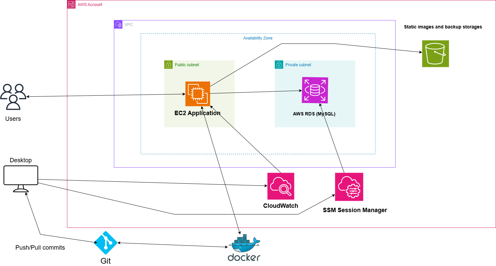
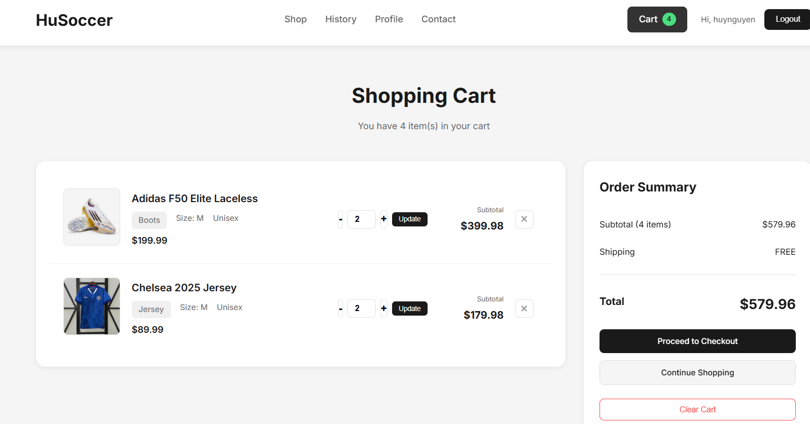
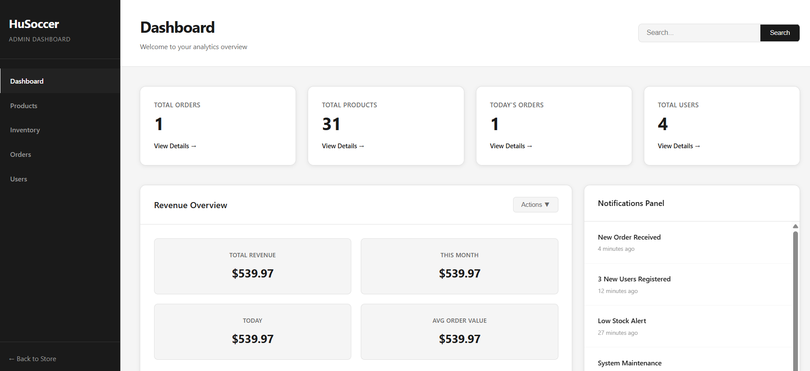
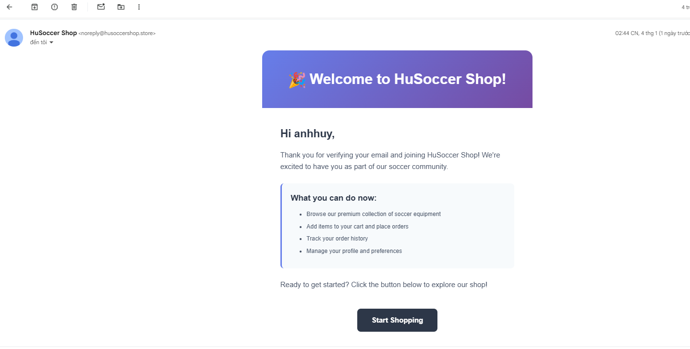

# HuSoccer Shop - E-commerce Platform

**Live Demo:** https://husoccershop.site

A full-stack e-commerce platform for soccer equipment built with Spring Boot and deployed on AWS EC2.

---

## Overview

Production-ready e-commerce application with user authentication, shopping cart, order management, and admin dashboard.

**Key Highlights:**
- Secure authentication with role-based access control
- Real-time inventory management and analytics
- Automated email notifications
- Docker containerization
- AWS cloud deployment

---

## Tech Stack

| Category | Technologies |
|----------|-------------|
| **Backend** | Java 17, Spring Boot 3.x, Spring Security, Spring Data JPA |
| **Database** | MySQL 8.0 |
| **Frontend** | Thymeleaf, HTML5, CSS3, JavaScript |
| **DevOps** | Docker, Docker Compose, AWS EC2, AWS S3 |
| **Email** | Resend SMTP API |
| **Security** | BCrypt, CSRF Protection, SSL/TLS |

---

## Architecture



**Deployment:** AWS EC2 (t2.medium) • Docker Compose • MySQL 8.0 • Resend SMTP • AWS S3

---

## Features

### 🛒 Shopping Experience
Product catalog with search, filtering, and secure checkout with multiple payment methods.


### 🛍️ Shopping Cart
Real-time cart management with dynamic pricing and inventory validation.



### 👨‍💼 Admin Dashboard
Complete product, user, and order management with analytics and revenue tracking.



### 📧 Email Notifications
Automated email verification and order confirmations.



---

## Quick Start

```bash
# Clone repository
git clone https://github.com/yourusername/Soccer-Items-Store.git
cd Soccer-Items-Store

# Configure environment
cp .env.example .env
# Edit .env with your credentials

# Run with Docker
docker-compose up -d --build

# Access at http://localhost:8080
```

**Default Admin:** `huynguyen` / `admin123`

---

## Environment Setup

| Variable | Description | Example |
|----------|-------------|---------|
| `SPRING_DATASOURCE_URL` | Database URL | `jdbc:mysql://mysql:3306/soccerstore` |
| `SPRING_DATASOURCE_USERNAME` | DB username | `socceruser` |
| `SPRING_DATASOURCE_PASSWORD` | DB password | `your_password` |
| `ADMIN_USERNAME` | Admin username | `huynguyen` |
| `ADMIN_PASSWORD` | Admin password | `your_password` |
| `MAIL_HOST` | SMTP host | `smtp.resend.com` |
| `MAIL_PASSWORD` | Resend API key | `your_api_key` |
| `MAIL_FROM` | Sender email | `noreply@yourdomain.com` |

Copy `.env.example` to `.env` and update with your credentials.

---

## Key Features

**Customer:**
- Product catalog with search and filtering
- Shopping cart with size/quantity selection
- User registration with email verification
- Order history and tracking
- Profile management with avatar upload

**Admin:**
- Product management (CRUD)
- User management with role assignment
- Order tracking and management
- Analytics dashboard with revenue metrics
- Inventory control with stock alerts

**Security:**
- BCrypt password encryption
- Role-based access control (RBAC)
- CSRF protection
- SQL injection prevention (JPA)
- Secure session management

---

## Database Schema

| Entity | Description |
|--------|-------------|
| **User** | Authentication and profile (userName, password, email, role, avatarUrl) |
| **Item** | Product catalog (name, category, price, quantity, sizes, image) |
| **Order** | Customer orders (fullName, address, paymentMethod, totalAmount) |
| **OrderItem** | Order line items (productName, size, quantity, price) |

---

## API Endpoints

| Access Level | Endpoints |
|--------------|-----------|
| **Public** | `/` (home), `/menu` (catalog), `/login`, `/register` |
| **Authenticated** | `/order`, `/history`, `/profile`, `/profile/upload-avatar` |
| **Admin** | `/admin`, `/admin/saveItem`, `/admin/createUser`, `/analytics` |

---

## AWS Deployment

```bash
# Connect to EC2
ssh -i hu.pem ec2-user@your-ec2-ip

# Clone and setup
git clone https://github.com/yourusername/Soccer-Items-Store.git
cd Soccer-Items-Store/Soccer-Items-Store
nano .env  # Configure environment

# Deploy
docker-compose up -d --build

# Verify
docker-compose ps
docker-compose logs -f app
```

**Security Group:** Allow ports 22 (SSH), 8080 (HTTP)

---

## Contact

**Developer:** Huy Nguyen  
**Email:** vuanhhuynguyen053004@gmail.com  
**Live Site:** https://husoccershop.site

---

**Built with Spring Boot • Deployed on AWS EC2 • Containerized with Docker**
