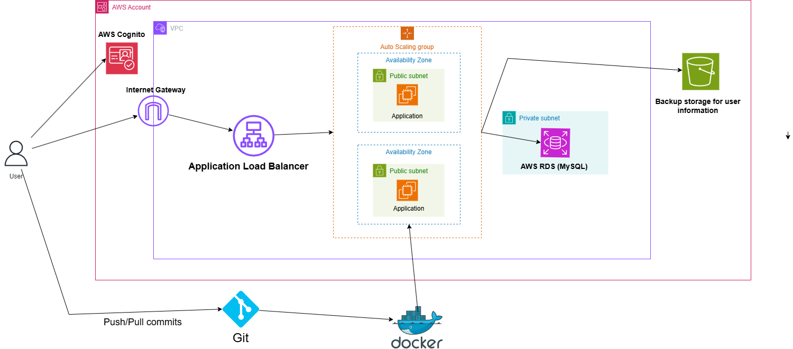

# ⚽ HuSoccer Shop - Premium Soccer Equipment E-commerce Platform

<div align="center">



**Live Demo:** [https://husoccershop.store](https://husoccershop.store)

[](https://www.oracle.com/java/)
[](https://spring.io/projects/spring-boot)
[](https://www.mysql.com/)
[](https://www.docker.com/)
[](https://aws.amazon.com/)
[](LICENSE)

*A modern, cloud-native e-commerce platform for soccer enthusiasts*

[Features](#-features) • [Tech Stack](#-technology-stack) • [Architecture](#-architecture) • [Installation](#-installation--setup) • [Deployment](#-deployment) • [API](#-api-documentation)

</div>

---

## 📋 Table of Contents

- [Overview](#-overview)
- [Features](#-features)
- [Technology Stack](#-technology-stack)
- [Architecture](#-architecture)
- [Installation & Setup](#-installation--setup)
- [Deployment](#-deployment)
- [Database Schema](#-database-schema)
- [API Documentation](#-api-documentation)
- [Security](#-security)
- [Configuration](#-configuration)
- [Contributing](#-contributing)
- [License](#-license)

---

## 🎯 Overview

**HuSoccer Shop** is a full-stack e-commerce platform designed specifically for soccer equipment and merchandise. Built with enterprise-grade technologies and deployed on AWS, it provides a seamless shopping experience for customers and powerful management tools for administrators.

### Why HuSoccer Shop?

- **🎨 Modern UI/UX**: Clean, responsive design optimized for all devices
- **🔒 Enterprise Security**: Multi-layer authentication with role-based access control
- **☁️ Cloud-Native**: Deployed on AWS with auto-scaling and high availability
- **📊 Analytics Dashboard**: Real-time insights into sales, users, and inventory
- **🚀 Performance**: Containerized architecture with optimized database queries
- **🛡️ Production-Ready**: SSL/HTTPS, automated backups, and monitoring

---

## ✨ Features

### 🛍️ Customer Features

| Feature | Description |
|---------|-------------|
| **Product Catalog** | Browse curated selection of soccer boots, jerseys, and accessories |
| **Smart Search** | Real-time search with category and price filtering |
| **Shopping Cart** | Add products with size and quantity selection |
| **User Accounts** | Secure registration and profile management |
| **Order History** | Track past purchases and order details |
| **Avatar Upload** | Personalize profile with custom avatars |
| **Responsive Design** | Seamless experience across desktop, tablet, and mobile |

### 👨‍💼 Admin Features

| Feature | Description |
|---------|-------------|
| **Product Management** | Add, edit, and delete products with image upload |
| **User Management** | Create, update, delete users and assign admin roles |
| **Order Management** | View and process customer orders with detailed information |
| **Analytics Dashboard** | System-wide statistics, revenue tracking, and top customers |
| **Inventory Control** | Track stock levels with visual indicators |
| **S3 Backup System** | Automatic encrypted backups of user data |

### 🎨 UI/UX Features

- **Modern Black & White Design**: Professional, minimalist aesthetic
- **Image Slideshow**: Featured products carousel
- **Stock Indicators**: Visual status (In Stock, Low Stock, Out of Stock)
- **Sorting Options**: Sort by name, price, and availability
- **Form Validation**: Helpful error messages and input hints
- **Loading States**: Smooth transitions and feedback

---

## 🛠️ Technology Stack

### Backend

```
Java 17                    Programming Language
Spring Boot 3.x            Application Framework
Spring Security            Authentication & Authorization
Spring Data JPA            ORM & Database Operations
MySQL 8.0                  Relational Database
Maven                      Dependency Management
Thymeleaf                  Server-side Templating
```

### Frontend

```
HTML5/CSS3                 Markup & Styling
JavaScript                 Client-side Functionality
Thymeleaf                  Dynamic Content Rendering
Responsive Design          Mobile-first Approach
```

### Infrastructure & DevOps

```
Docker                     Containerization
Docker Compose             Multi-container Orchestration
AWS EC2                    Cloud Hosting
AWS S3                     File Storage & Backups
AWS RDS                    Managed Database (Production)
AWS Route 53               DNS Management
Nginx                      Reverse Proxy & SSL
Let's Encrypt              SSL Certificates
```

### Development Tools

```
Git                        Version Control
GitHub                     Code Repository
Maven                      Build Automation
IntelliJ IDEA              IDE
Postman                    API Testing
```

---

## 🏗️ Architecture

### Application Architecture

```
┌─────────────────────────────────────────────────────────────────┐
│                        Presentation Layer                       │
│  ┌──────────────┐  ┌──────────────┐  ┌──────────────┐         │
│  │ Controllers  │  │  Templates   │  │  Static CSS  │         │
│  └──────────────┘  └──────────────┘  └──────────────┘         │
└─────────────────────────────────────────────────────────────────┘
                              ↓
┌─────────────────────────────────────────────────────────────────┐
│                         Business Layer                          │
│  ┌──────────────┐  ┌──────────────┐  ┌──────────────┐         │
│  │   Services   │  │     DTOs     │  │  Validators  │         │
│  └──────────────┘  └──────────────┘  └──────────────┘         │
└─────────────────────────────────────────────────────────────────┘
                              ↓
┌─────────────────────────────────────────────────────────────────┐
│                          Data Layer                             │
│  ┌──────────────┐  ┌──────────────┐  ┌──────────────┐         │
│  │ Repositories │  │   Entities   │  │    MySQL     │         │
│  └──────────────┘  └──────────────┘  └──────────────┘         │
└─────────────────────────────────────────────────────────────────┘
```

### AWS Cloud Architecture

The application leverages multiple AWS services for scalability, security, and reliability:

#### Core AWS Services

| Service | Purpose | Configuration |
|---------|---------|---------------|
| **EC2** | Application Hosting | t2.medium, Auto Scaling, Multi-AZ |
| **RDS** | Database | MySQL 8.0, Multi-AZ, Automated Backups |
| **S3** | File Storage | Private bucket for user backups |
| **Route 53** | DNS Management | Domain: husoccershop.store |
| **ALB** | Load Balancing | SSL termination, Health checks |
| **VPC** | Network Isolation | Public/Private subnets, Security Groups |
| **CloudWatch** | Monitoring | Metrics, Logs, Alarms |
| **IAM** | Access Control | EC2 instance roles, Least privilege |

#### Network Architecture

```
                    ┌─────────────────┐
                    │   Route 53      │
                    │  (DNS Service)  │
                    └────────┬────────┘
                             │
                    ┌────────▼────────┐
                    │  Load Balancer  │
                    │   (SSL/HTTPS)   │
                    └────────┬────────┘
                             │
        ┌────────────────────┼────────────────────┐
        │                    │                    │
   ┌────▼────┐         ┌────▼────┐         ┌────▼────┐
   │  EC2-1  │         │  EC2-2  │         │  EC2-3  │
   │  (App)  │         │  (App)  │         │  (App)  │
   └────┬────┘         └────┬────┘         └────┬────┘
        │                    │                    │
        └────────────────────┼────────────────────┘
                             │
                    ┌────────▼────────┐
                    │   RDS MySQL     │
                    │   (Multi-AZ)    │
                    └─────────────────┘
```

### Container Architecture

```
Docker Host (EC2 Instance)
│
├── soccer-app Container
│   ├── Spring Boot Application (Port 8080)
│   ├── Thymeleaf Templates
│   ├── Static Resources
│   └── Application Logs
│
├── soccer-mysql Container
│   ├── MySQL 8.0 (Port 3306)
│   ├── Database Files
│   └── Persistent Volume
│
└── Docker Network
    └── Internal Communication
```

### Security Architecture

```
┌─────────────────────────────────────────────────────────────┐
│                      Security Layers                        │
├─────────────────────────────────────────────────────────────┤
│  Network Security                                           │
│  • Security Groups (Firewall rules)                         │
│  • VPC Isolation                                            │
│  • SSH Key Authentication                                   │
├─────────────────────────────────────────────────────────────┤
│  Transport Security                                         │
│  • SSL/TLS Encryption (Let's Encrypt)                       │
│  • HTTPS Redirect                                           │
│  • Secure Headers                                           │
├─────────────────────────────────────────────────────────────┤
│  Application Security                                       │
│  • Spring Security                                          │
│  • BCrypt Password Hashing                                  │
│  • CSRF Protection                                          │
│  • Role-based Access Control (USER/ADMIN)                   │
├─────────────────────────────────────────────────────────────┤
│  Data Security                                              │
│  • Database Authentication                                  │
│  • Encrypted S3 Backups (AES256)                            │
│  • Container Isolation                                      │
│  • No passwords in backups                                  │
└─────────────────────────────────────────────────────────────┘
```

---

## 🚀 Installation & Setup

### Prerequisites

- **Java 17+** - [Download](https://www.oracle.com/java/technologies/downloads/)
- **Docker & Docker Compose** - [Download](https://www.docker.com/products/docker-desktop)
- **Git** - [Download](https://git-scm.com/downloads)
- **Maven 3.8+** (optional, included in Docker)

### Local Development Setup

1. **Clone the Repository**
   ```bash
   git clone https://github.com/yourusername/Soccer-Items-Store.git
   cd Soccer-Items-Store
   ```

2. **Configure Environment Variables**
   ```bash
   cp .env.example .env
   # Edit .env with your configuration
   ```

3. **Build and Run with Docker**
   ```bash
   docker-compose up --build
   ```

4. **Access the Application**
   ```
   Application: http://localhost:8080
   MySQL:       localhost:3307
   ```

5. **Default Admin Credentials**
   ```
   Username: huynguyen
   Password: admin123
   ```

### Manual Setup (Without Docker)

1. **Install MySQL 8.0**
   ```bash
   # Create database
   mysql -u root -p
   CREATE DATABASE soccerstore;
   ```

2. **Configure Application**
   ```bash
   # Edit src/main/resources/application.properties
   spring.datasource.url=jdbc:mysql://localhost:3306/soccerstore
   spring.datasource.username=your_username
   spring.datasource.password=your_password
   ```

3. **Build and Run**
   ```bash
   mvn clean package
   java -jar target/Soccer-Items-Store-0.0.1-SNAPSHOT.jar
   ```

---

## 📦 Deployment

### AWS EC2 Deployment

#### Step 1: Launch EC2 Instance

```bash
# Instance Type: t2.medium or t3.medium
# OS: Amazon Linux 2023
# Storage: 20-30 GB EBS
# Security Group: Allow ports 22, 80, 443, 8080
```

#### Step 2: Connect and Install Dependencies

```bash
# Connect to EC2
ssh -i your-key.pem ec2-user@your-ec2-ip

# Install Docker
sudo yum update -y
sudo yum install docker -y
sudo service docker start
sudo usermod -a -G docker ec2-user

# Install Docker Compose
sudo curl -L "https://github.com/docker/compose/releases/latest/download/docker-compose-$(uname -s)-$(uname -m)" -o /usr/local/bin/docker-compose
sudo chmod +x /usr/local/bin/docker-compose
```

#### Step 3: Deploy Application

```bash
# Clone repository
git clone https://github.com/yourusername/Soccer-Items-Store.git
cd Soccer-Items-Store

# Configure environment
nano .env
# Add your production configuration

# Build and start
docker-compose up -d --build
```

#### Step 4: Setup SSL with Let's Encrypt

```bash
# Install Certbot
sudo yum install certbot python3-certbot-nginx -y

# Obtain certificate
sudo certbot --nginx -d husoccershop.store -d www.husoccershop.store

# Auto-renewal (already configured)
sudo certbot renew --dry-run
```

#### Step 5: Configure IAM Role for S3

1. Create IAM role: `SoccerShop-EC2-Role`
2. Attach policy for S3 access
3. Attach role to EC2 instance
4. Restart application

**Detailed Guide:** See [EC2-DEPLOYMENT.md](EC2-DEPLOYMENT.md)

### Docker Deployment

```bash
# Build image
docker build -t soccer-shop:latest .

# Run container
docker run -d -p 8080:8080 \
  -e SPRING_DATASOURCE_URL=jdbc:mysql://host:3306/db \
  -e SPRING_DATASOURCE_USERNAME=user \
  -e SPRING_DATASOURCE_PASSWORD=pass \
  soccer-shop:latest
```

---

## 🗄️ Database Schema

### Entity Relationship Diagram

```
┌─────────────┐         ┌─────────────┐         ┌─────────────┐
│    User     │         │    Order    │         │  OrderItem  │
├─────────────┤         ├─────────────┤         ├─────────────┤
│ user_id (PK)│         │ id (PK)     │         │ id (PK)     │
│ userName    │◄───────┤│ username    │         │ order_id(FK)│
│ password    │         │ fullName    │◄───────┤│ productName │
│ email       │         │ address     │         │ category    │
│ role        │         │ totalAmount │         │ size        │
│ fullName    │         │ orderDate   │         │ quantity    │
│ phone       │         │ paymentMethod│        │ price       │
│ avatarUrl   │         └─────────────┘         │ image       │
└─────────────┘                                 └─────────────┘

┌─────────────┐
│    Item     │
├─────────────┤
│ id (PK)     │
│ name        │
│ category    │
│ quantity    │
│ price       │
│ gender      │
│ sizes       │
│ image       │
└─────────────┘
```

### Tables

#### Users Table
```sql
CREATE TABLE user (
    user_id BIGINT PRIMARY KEY AUTO_INCREMENT,
    userName VARCHAR(20) UNIQUE NOT NULL,
    password VARCHAR(100) NOT NULL,
    email VARCHAR(100) NOT NULL,
    role VARCHAR(10) NOT NULL,
    fullName VARCHAR(100),
    phone VARCHAR(20),
    avatarUrl VARCHAR(500)
);
```

#### Orders Table
```sql
CREATE TABLE orders (
    id BIGINT PRIMARY KEY AUTO_INCREMENT,
    username VARCHAR(50) NOT NULL,
    fullName VARCHAR(100) NOT NULL,
    address VARCHAR(200) NOT NULL,
    city VARCHAR(50) NOT NULL,
    state VARCHAR(50) NOT NULL,
    zipCode VARCHAR(20) NOT NULL,
    phone VARCHAR(20) NOT NULL,
    paymentMethod VARCHAR(50) NOT NULL,
    totalAmount DECIMAL(10,2) NOT NULL,
    orderDate TIMESTAMP DEFAULT CURRENT_TIMESTAMP
);
```

---

## 📡 API Documentation

### Public Endpoints

| Method | Endpoint | Description | Auth Required |
|--------|----------|-------------|---------------|
| GET | `/` | Home page (redirects to menu) | No |
| GET | `/menu` | Product catalog | No |
| GET | `/login` | Login page | No |
| GET | `/register` | Registration page | No |
| POST | `/register` | Create new account | No |

### User Endpoints

| Method | Endpoint | Description | Auth Required |
|--------|----------|-------------|---------------|
| POST | `/order` | Place order | USER/ADMIN |
| GET | `/order` | View cart | USER/ADMIN |
| POST | `/checkout` | Complete purchase | USER/ADMIN |
| GET | `/history` | Order history | USER/ADMIN |
| GET | `/profile` | User profile | USER/ADMIN |
| POST | `/profile/update` | Update profile | USER/ADMIN |
| POST | `/profile/upload-avatar` | Upload avatar | USER/ADMIN |
| POST | `/profile/change-password` | Change password | USER/ADMIN |

### Admin Endpoints

| Method | Endpoint | Description | Auth Required |
|--------|----------|-------------|---------------|
| GET | `/admin` | Admin dashboard | ADMIN |
| POST | `/admin/saveItem` | Add/Update product | ADMIN |
| GET | `/admin/delete/{id}` | Delete product | ADMIN |
| GET | `/admin/edit/{id}` | Edit product | ADMIN |
| POST | `/admin/createUser` | Create user | ADMIN |
| POST | `/admin/updateUser` | Update user | ADMIN |
| GET | `/admin/deleteUser/{id}` | Delete user | ADMIN |
| GET | `/admin/toggleRole/{id}` | Toggle user role | ADMIN |
| GET | `/analytics` | Analytics dashboard | ADMIN |

### S3 API Endpoints

| Method | Endpoint | Description | Auth Required |
|--------|----------|-------------|---------------|
| POST | `/api/s3/upload-json/{key}` | Upload JSON to S3 | ADMIN |
| GET | `/api/s3/download/{key}` | Download file from S3 | ADMIN |
| GET | `/api/s3/backup/{key}` | Download backup | ADMIN |

---

## 🔒 Security

### Authentication & Authorization

- **Spring Security** with form-based authentication
- **BCrypt** password hashing (strength: 10)
- **Role-based access control**: USER and ADMIN roles
- **Session management** with secure cookies
- **CSRF protection** enabled for all POST requests

### Data Protection

- **Password Security**: Never stored in plain text, BCrypt hashed
- **S3 Backups**: Encrypted with AES256, passwords excluded
- **SQL Injection Prevention**: JPA/Hibernate parameterized queries
- **XSS Protection**: Thymeleaf auto-escaping
- **HTTPS**: SSL/TLS encryption for all traffic

### Network Security

- **Security Groups**: Firewall rules limiting access
- **VPC Isolation**: Private subnets for database
- **SSH Key Authentication**: No password-based SSH
- **Rate Limiting**: Protection against brute force attacks

### Validation

- **Username**: 3-20 characters, alphanumeric and underscores only
- **Email**: Valid email format required
- **Password**: Minimum 6 characters
- **Input Sanitization**: All user inputs validated and sanitized

---

## ⚙️ Configuration

### Environment Variables

```bash
# Database Configuration
SPRING_DATASOURCE_URL=jdbc:mysql://mysql:3306/soccerstore
SPRING_DATASOURCE_USERNAME=socceruser
SPRING_DATASOURCE_PASSWORD=soccerpass
SPRING_JPA_HIBERNATE_DDL_AUTO=update

# Admin User Configuration
ADMIN_USERNAME=huynguyen
ADMIN_PASSWORD=admin123
ADMIN_EMAIL=huynguyen@husoccer.com

# AWS Configuration
AWS_BUCKET_NAME=husoccer-shop
AWS_REGION=us-east-1

# Email Configuration (Gmail SMTP)
MAIL_HOST=smtp.gmail.com
MAIL_PORT=587
MAIL_USERNAME=your-email@gmail.com
MAIL_PASSWORD=your-app-password

# File Upload Configuration
UPLOAD_PATH=uploads/avatars

# Application Configuration
SERVER_PORT=8080
```

### Application Properties

Key configurations in `application.properties`:

```properties
# Database
spring.datasource.url=${SPRING_DATASOURCE_URL}
spring.jpa.hibernate.ddl-auto=update
spring.jpa.show-sql=false

# AWS S3
aws.bucket.name=${AWS_BUCKET_NAME}
cloud.aws.region.static=${AWS_REGION}

# File Upload
upload.path=${UPLOAD_PATH:uploads/avatars}
spring.servlet.multipart.max-file-size=5MB
spring.servlet.multipart.max-request-size=5MB

# Email
spring.mail.host=${MAIL_HOST}
spring.mail.port=${MAIL_PORT}
spring.mail.username=${MAIL_USERNAME}
spring.mail.password=${MAIL_PASSWORD}
```

---

## 🧪 Testing

### Run Tests

```bash
# Run all tests
mvn test

# Run specific test class
mvn test -Dtest=UserServiceTest

# Run with coverage
mvn clean test jacoco:report
```

### Manual Testing

```bash
# Health check
curl http://localhost:8080/menu

# Test authentication
curl -X POST http://localhost:8080/login \
  -d "username=huynguyen&password=admin123"
```

---

## 📊 Monitoring & Logs

### View Logs

```bash
# Application logs
docker-compose logs -f app

# Database logs
docker-compose logs -f mysql

# All logs
docker-compose logs -f
```

### Container Status

```bash
# Check running containers
docker-compose ps

# Check resource usage
docker stats
```

### AWS CloudWatch

- Application metrics (CPU, Memory, Disk)
- Custom application logs
- Automated alarms and notifications

---

## 🤝 Contributing

We welcome contributions! Please follow these steps:

1. **Fork the repository**
2. **Create a feature branch**
   ```bash
   git checkout -b feature/amazing-feature
   ```
3. **Commit your changes**
   ```bash
   git commit -m 'Add amazing feature'
   ```
4. **Push to the branch**
   ```bash
   git push origin feature/amazing-feature
   ```
5. **Open a Pull Request**

### Code Style

- Follow Java naming conventions
- Use meaningful variable and method names
- Add comments for complex logic
- Write unit tests for new features

---

## 📝 License

This project is licensed under the MIT License - see the [LICENSE](LICENSE) file for details.

---

## 👥 Authors

- **Huy Nguyen** - *Initial work* - [GitHub Profile](https://github.com/yourusername)

---

## 🙏 Acknowledgments

- Spring Boot team for the excellent framework
- AWS for reliable cloud infrastructure
- Docker for containerization technology
- The open-source community

---

## 📞 Support

For support, email huynguyen@husoccer.com or open an issue on GitHub.

---

<div align="center">

**⚽ Built with passion for soccer and technology! ⚽**

[⬆ Back to Top](#-husoccer-shop---premium-soccer-equipment-e-commerce-platform)

</div>
